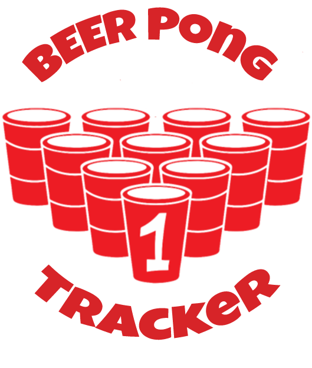
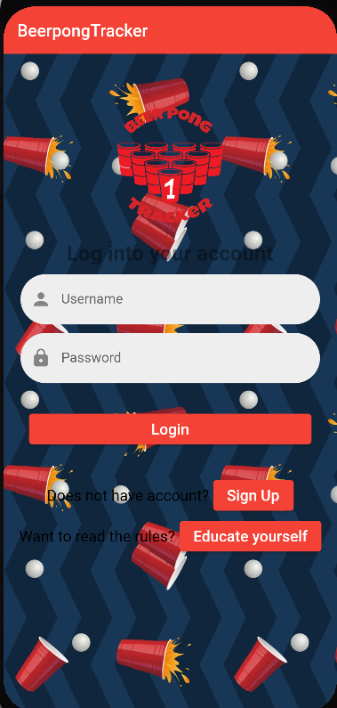
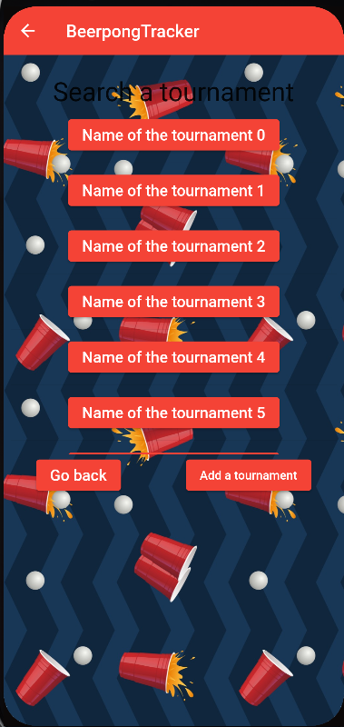
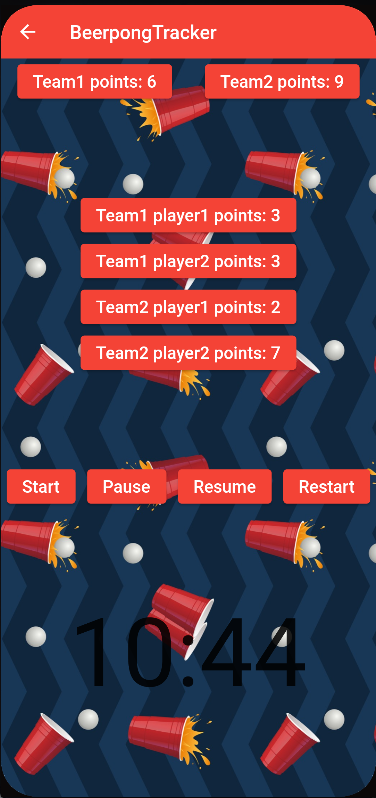

<!-- PROJECT LOGO -->
 

    
  <h3 align="center">BeerPongTracker</h3>

<!-- TABLE OF CONTENTS -->

  
Tartalomjegyzék

  <ol>
    <li>
      <a href="#A projekt célja">A projekt célja</a>
    </li>
    <li><a href="#Rendszerkövetelmények">Rendszerkövetelmények</a></li>
    <li><a href="#Használt nyelv és keretrendszer">Használt nyelv és keretrendszer</a></li>
    <li><a href="#Főbb elemek">Főbb elemek</a></li>
  </ol>

<!-- ABOUT THE PROJECT -->
## A projekt célja

A projekt celja egy sörpong  bajnokság nyomonkövetése, ahol lehet számolni a meccsen dobott labdák számát, a különleges dobásokat, illetve ki mennyit dobot be a poharakba, ezeket a rangsorolni a felhasználók bedobott labda pontszáma szerint. Ezeket az adatokat egy adatbazisban tároltuk ahonnan miután a felhasználó regisztrált ahányszor belép esélyt kap felhasználói adatai változtatásra. Mivel a mai világban szinte mindenki rendelkezik okostelefonnal, így akár egy meccs közben is könnyedén követheti a meccs állását, és vezetheti a saját statisztikáját. A felhasználó egyaránt lekérdezheti a jelenlevő bajnokságokat, illetve létre is hozhat bajnokságot.

    

    

    

## Rendszerkövetelmények:
* Android 10 (API level 29) és ennél újabb operációs rendszerek
* Mobilinternet kapcsolat vagy Wifi kapcsolat
* Legalább 150 MB szabad tárhely
* 2 GB RAM
* Android SDK

(<a href="#top">back to top</a>)

### Használt nyelv és keretrendszer

* [Flutter](https://flutter.dev/)
* [Dart](https://dart.dev/)

(<a href="#top">back to top</a>)

#### Főbb elemek

* Kezdőoldal: Ahonnan a felhasználó ha már egyszer regisztrált akkor újra bejelentkezhet, illetve van egy regisztráció gomb ahonnan átkerülnek egy regisztráció oldalra, illetve egy szabályzat gomb ahol eljutnak egy weboldalra ahol elolvashatják a szabályzatait a játék különböző fajtáinak.

* Regisztrációs felület: Ahol a nem regisztrált felhasználók tudnak maguknak profilt készíteni. Az adatok helyes kitöltése után és a ‘Sign Up’ gomb megnyomása után kezdhetik is a bejelentkezést.

* Saját profil: A bejelentkezés után ide kerülnek a felhasználók ahol tudnak változtatni az adatokon illetve lehetőségük van arra is, hogy törölni tudják a saját profiljukat és még egy gomb által átkerülhetnek a Bajnokság Csarnok menübe.

* Bajnokság Csarnok menü: Ahonnan a felhasználók kiválaszthatják a bajnokságot ahova be akarnak lépni illetve tudnak saját kezűleg letrehozni egyet.

* Bajnokság menü: Ahol a bajnokság játékai megtalálhatóak és kiírja, hogy melyik csapat játszik melyik ellen.

* Meccs menü: Itt a játékvezető követi a játék pontszámait és növeli annak a játekosnak pontszámát, illetve a csapat pontszámát, aki bedobott egy labdát a pohárba. Egy játéknak egy 12 perces időkorlát van állítva amit szükség esetén le lehet állítani, szüneteltetni és újraindítani.

(<a href="#top">back to top</a>)
